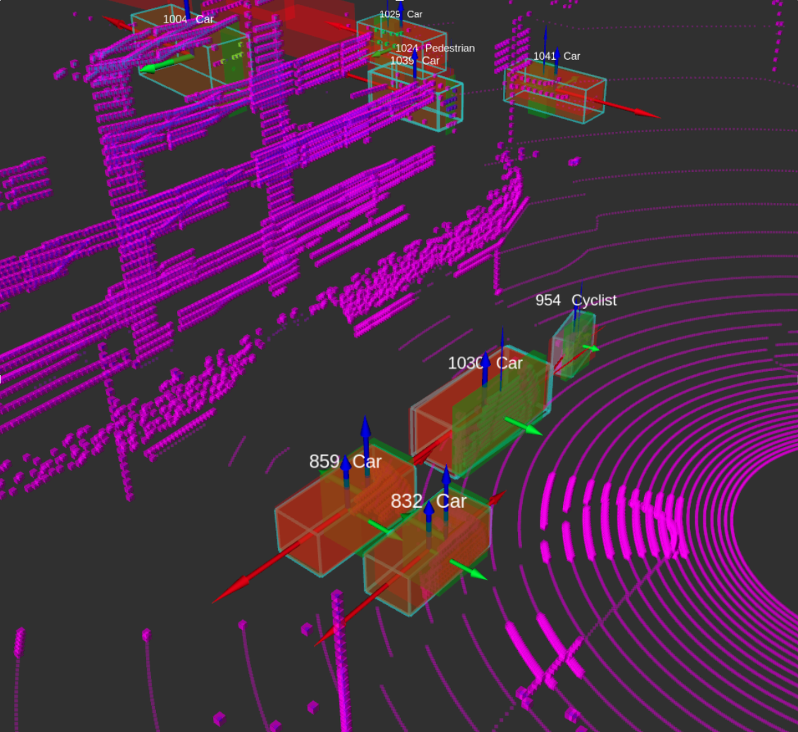

# Tracking to Detect: A Simple Yet Effective Self Labeling Baseline for 3D Object Detection

# Abstract
3D Object Detection from PointClouds is an essential part of the perception stack of
autonomous vehicles. Although LiDAR is a commonly used sensor for detection,
it has a larger domain shift from dataset to dataset, compared to other sensor
modalities. For this reason, collecting large amounts of ground truth data is crucial
for adapting an off-the-shelf model to the target domain. Since the cost of labeling
is an important consideration for companies, self-supervision is a good approach
to overcome the problem. In this research, we introduce a self-supervision and
auto-labeling pipeline that can be executed to adopt to a target domain, without
any amount of training in the target domain at all. The code is publicly available at
https://github.com/yucedagonurcan/TRADE_TrackingToDetect

# Pipeline

# Highlights
- We show the introduction of the detections with prior tracker information helps the accuracy
of the psuedo-labeled dataset
- We introduce a dynamic clustering algorithm that can optimize the found object with respect
the tracklet and its historic data
- We show adaptively selecting the proposal space of the shape fitting by the given tracklet
information both reduces computation complexity and improves the output object accuracy
- We present simple yet effective object fusion method that both keeps the best proposal for a
single object while effectively introduces the lost objects and increasing the recall in overall
pipeline
- We carefully lay out the importance of the life-cycle management for MOT modules and
show that with the correct scoring and life-cycle management of the tracklets, we further
improve the overall accuracy of the pipeline

